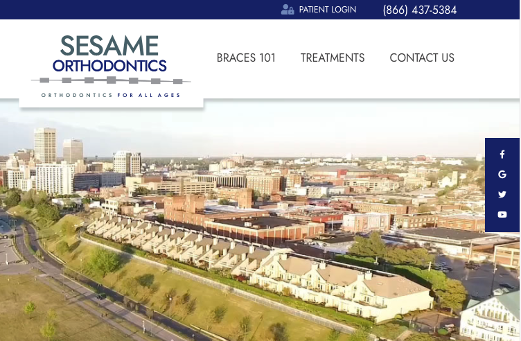

# Sesame-Web-Dev-Assessment
Sesame Communications Web Developer Assessment Test
Web Developer Assessment
 
Introduction
 
Thank you for your interest in joining the Web Team at Sesame Communications! The following is a quick test to give us an idea of your abilities.
 
This test assumes you have experience with responsive web design, CSS transitions, and Photoshop. Unless otherwise noted, you only need to make layout-based changes to the homepage—you do not need to do step 1 on the Meet Dr. Sam Sesame page, for example.
 
Please do not spend more than an hour on this test. If you find that you are struggling with the majority of the questions, or feel you would need at least an additional hour to wrap up all 10 questions, this role may not be a good fit. Feel free to use any resources (Stack Overflow, tutorials, etc.) during that one-hour timeframe—this is an “open book” test.
 
Opening the Test
 
Open the test in your code editor of choice by opening up sesameorthodontics.com/index.html. All of the files you will need to edit are located inside the sesameorthodontics.com folder. 

Take some time to review each task before beginning, and aim to complete as many tasks as possible within the given timeframe. If you are stuck on a task, skip it and move on to the next one.

Good luck!
 
Tasks
 
1. In the mobile view, hide the social media icons (Facebook, Google, Twitter, YouTube).

2. In the tablet (768px - 1024px) and desktop (1024px+) views, make the social icon section “fixed” to the right side of the screen in a 50px wide column. Position it 200px from the top of the screen. Give it a background color and some padding. Center the icons. The end result should look like this:

3. Beneath the large banner photo area, you will find four callout buttons (Meet Dr. Sesame, Complimentary Consultation, etc). Replace the background photo in the “Why Trust Our Office” section with callout-replacement.jpg found in /resources.

4. Currently, when you hover over one of those four callout buttons, a blue background swipes in behind the text, left to right. Instead, make the blue background swipe in from bottom to top on hover.

5. In the “Smile Financing Options” section, increase the height of the “Learn More” button to 56px.

6. Rather than simply growing on hover, give the “Learn More” button a more eye-catching animation. Maybe a border draws around the outside of it, maybe a new color fades in from one of the corners, maybe the button tilts to one side and a drop shadow appears, or maybe something different entirely--the choice is yours!

7. On the meet-dr-sam-sesame.html page, using CSS, change the doctor’s photo to a circle.

8. Using Photoshop, change the color of the word “SESAME” in the header logo to #6e86ba, and swap the resulting image into the header. Try to complete the color swap in a way that minimizes harm to the quality of the lettering (no jagged/blurry edges).
 
Completing the Test
 
Once complete, zip your files into an archive in the format yourlastname-yourfirstname.zip and upload to the following URL:
 
https://sesamewebdesign.sharefile.com/r-rd76f593154744279
 
Please send me an email at mpedersen@sesamecommunications.com to let me know you have finished the test and uploaded the files.
 
That’s it!
